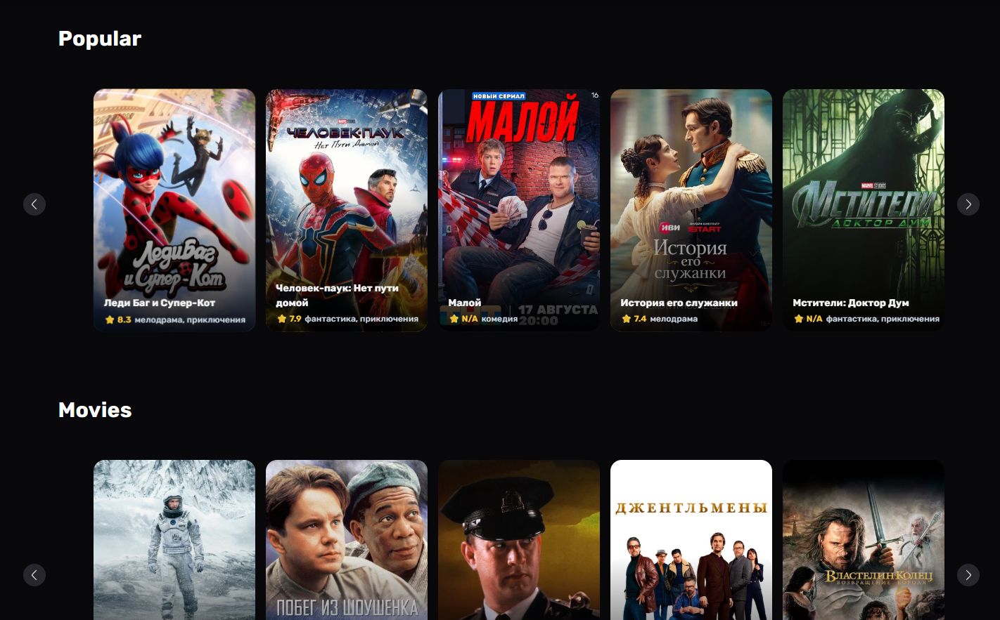

# 🎬 Kinopoisk / Netflix clone

Лендинг стриминг-сервиса, свёрстанный с нуля на HTML, CSS и JavaScript. Проект сделан для отработки чистой семантической вёрстки, работы с модальными окнами и адаптивности без использования фреймворков.

## 🌐 Демо

👉 https://joyl-script.github.io/my-eight-syte/

## 🛠 Технологии

- HTML5 (семантическая разметка)
- CSS3 (Flexbox/Grid, медиа-запросы)
- Vanilla JavaScript (открытие/закрытие модалок)

## ⚙️ Функционал

- Hero-секция с призывом к действию
- Модальные окна логина и регистрации
- Адаптивная вёрстка под мобильные устройства
- Футер со ссылками на соцсети

## 📸 Скриншоты



## 🚀 Запуск локально

```bash
git clone https://github.com/joyl-script/my-eight-syte.git
cd my-eight-syte
# открыть index.html в браузере,
# либо через Live Server в VS Code
```
